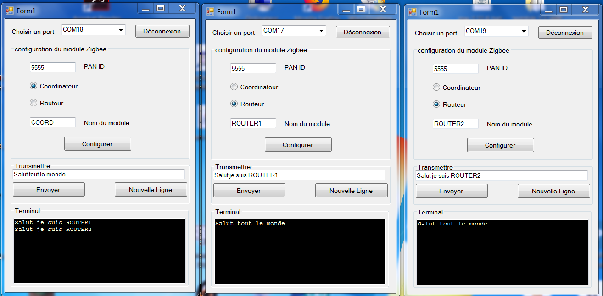

# Zigbee Configurator #

Un petit logiciel de configuration de modules Zigbee série 2C pour mettre en oeuvre un réseau mesh en mode brodcast composé d'un coordinateur et de un ou plusieurs routeurs. Il n'est pas prévu de configurer des End-devices dans cette version.

Les options configurées sont :

- PAN ID
- JV (0:coordinator / 1:router)
- CE (1:coordinator / 0:router)
- DL (0:router / FFFF:coordinator mode broadcast)
- NI (nom du device - name Identifier)

Mise à jour : Lecture de la configuration courante du module.